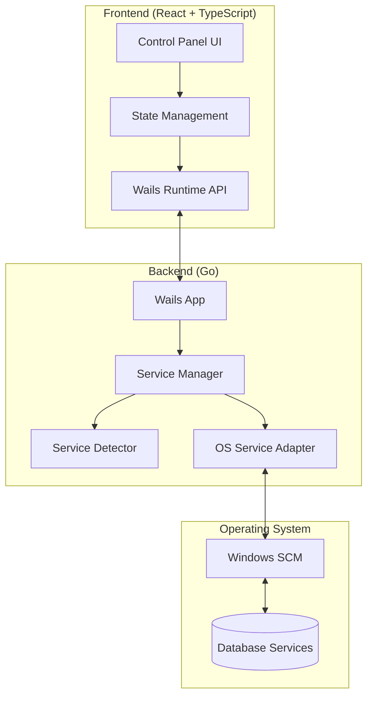

# Design Document

## Overview

The Service Database Dashboard is a cross-platform desktop application built with Wails v2, combining a Go backend with a React TypeScript frontend. The architecture prioritizes minimal resource consumption while providing real-time service management capabilities. The application uses native OS APIs for service control and implements efficient polling mechanisms to maintain awareness of service states.

## Architecture

### High-Level Architecture



### Technology Stack

- **Framework**: Wails v2 (using Vite/React-TS template)
- **Backend**: Go 1.21+
- **Frontend**: React 18+ with TypeScript 5+
- **Build Tool**: Vite
- **Styling**: CSS Modules (lightweight, no heavy UI libraries)

### Design Principles

1. **Minimal Dependencies**: Use standard library and Wails runtime only
2. **Efficient Polling**: 5-second intervals with exponential backoff on errors
3. **Native Integration**: Direct OS API calls without middleware
4. **Lazy Loading**: Load service information only when needed
5. **Memory Efficiency**: Reuse objects, avoid unnecessary allocations

## Components and Interfaces

### Backend Components

#### 1. Service Manager (`app/service_manager.go`)

Core component that orchestrates service operations.

```go
type ServiceManager struct {
    detector ServiceDetector
    adapter  OSServiceAdapter
    cache    *ServiceCache
}

type Service struct {
    Name        string
    DisplayName string
    Status      ServiceStatus
    Type        ServiceType
}

type ServiceStatus string
const (
    StatusRunning     ServiceStatus = "running"
    StatusStopped     ServiceStatus = "stopped"
    StatusStarting    ServiceStatus = "starting"
    StatusStopping    ServiceStatus = "stopping"
    StatusRestarting  ServiceStatus = "restarting"
)

type ServiceType string
const (
    TypePostgreSQL ServiceType = "postgresql"
    TypeMongoDB    ServiceType = "mongodb"
)

// Public methods exposed to frontend
func (sm *ServiceManager) GetServices() ([]Service, error)
func (sm *ServiceManager) StartService(name string) error
func (sm *ServiceManager) StopService(name string) error
func (sm *ServiceManager) RestartService(name string) error
func (sm *ServiceManager) GetServiceStatus(name string) (ServiceStatus, error)
```

#### 2. Service Detector (`app/detector.go`)

Identifies installed database services on the system.

```go
type ServiceDetector interface {
    DetectServices() ([]Service, error)
}

type WindowsServiceDetector struct {
    knownPatterns map[ServiceType][]string
}

// Patterns for service name matching
var servicePatterns = map[ServiceType][]string{
    TypePostgreSQL: {"postgresql", "postgres"},
    TypeMongoDB:    {"mongodb", "mongo"},
}
```

#### 3. OS Service Adapter (`app/os_adapter.go`)

Abstracts OS-specific service control operations.

```go
type OSServiceAdapter interface {
    ListServices() ([]OSService, error)
    GetServiceStatus(name string) (ServiceStatus, error)
    StartService(name string) error
    StopService(name string) error
    RestartService(name string) error
}

type WindowsServiceAdapter struct {
    // Uses golang.org/x/sys/windows/svc package
}

type OSService struct {
    Name        string
    DisplayName string
    State       uint32
}
```

#### 4. Service Cache (`app/cache.go`)

In-memory cache to reduce OS API calls.

```go
type ServiceCache struct {
    services    map[string]*Service
    lastUpdate  time.Time
    ttl         time.Duration
    mu          sync.RWMutex
}

func (sc *ServiceCache) Get(name string) (*Service, bool)
func (sc *ServiceCache) Set(name string, service *Service)
func (sc *ServiceCache) IsExpired() bool
func (sc *ServiceCache) Clear()
```

### Frontend Components

#### 1. App Component (`frontend/src/App.tsx`)

Root component managing application state.

```typescript
interface AppState {
  services: Service[];
  loading: boolean;
  error: string | null;
}

function App() {
  const [state, setState] = useState<AppState>({
    services: [],
    loading: true,
    error: null
  });
  
  // Polling logic with 5-second interval
  // Service refresh on mount
  // Error handling
}
```

#### 2. Service List Component (`frontend/src/components/ServiceList.tsx`)

Displays the list of services.

```typescript
interface ServiceListProps {
  services: Service[];
  onStart: (name: string) => void;
  onStop: (name: string) => void;
  onRestart: (name: string) => void;
}

function ServiceList({ services, onStart, onStop, onRestart }: ServiceListProps) {
  // Renders service rows
  // Handles empty state
}
```

#### 3. Service Row Component (`frontend/src/components/ServiceRow.tsx`)

Individual service display with controls.

```typescript
interface ServiceRowProps {
  service: Service;
  onStart: () => void;
  onStop: () => void;
  onRestart: () => void;
}

function ServiceRow({ service, onStart, onStop, onRestart }: ServiceRowProps) {
  const [loading, setLoading] = useState(false);
  
  // Status badge with color coding
  // Action buttons (Start/Stop/Restart)
  // Loading states
  // Disabled states based on current status
}
```

#### 4. Wails Bindings (`frontend/src/wailsjs/go/app/ServiceManager.ts`)

Auto-generated by Wails for Go method calls.

```typescript
export function GetServices(): Promise<Service[]>;
export function StartService(name: string): Promise<void>;
export function StopService(name: string): Promise<void>;
export function RestartService(name: string): Promise<void>;
export function GetServiceStatus(name: string): Promise<string>;
```

## Data Models

### Service Model

```typescript
// Frontend TypeScript
interface Service {
  Name: string;
  DisplayName: string;
  Status: ServiceStatus;
  Type: ServiceType;
}

type ServiceStatus = 
  | "running" 
  | "stopped" 
  | "starting" 
  | "stopping" 
  | "restarting";

type ServiceType = "postgresql" | "mongodb";
```

```go
// Backend Go
type Service struct {
    Name        string        `json:"Name"`
    DisplayName string        `json:"DisplayName"`
    Status      ServiceStatus `json:"Status"`
    Type        ServiceType   `json:"Type"`
}
```

## Error Handling

### Backend Error Handling

1. **Permission Errors**: Detect insufficient privileges and return specific error codes
2. **Service Not Found**: Return clear error when service doesn't exist
3. **Operation Timeout**: 30-second timeout for service operations
4. **State Conflicts**: Handle cases where service is already in target state

```go
type ServiceError struct {
    Code    ErrorCode
    Message string
    Service string
}

type ErrorCode int
const (
    ErrPermissionDenied ErrorCode = iota
    ErrServiceNotFound
    ErrOperationTimeout
    ErrInvalidState
    ErrSystemError
)
```

### Frontend Error Handling

1. **Display Error Messages**: Show user-friendly error notifications
2. **Retry Logic**: Allow manual retry for failed operations
3. **Graceful Degradation**: Show cached data if refresh fails
4. **Permission Prompts**: Guide user to run as administrator when needed

```typescript
interface ErrorState {
  message: string;
  code?: string;
  serviceName?: string;
}

function handleServiceError(error: any, serviceName: string): ErrorState {
  // Parse error from backend
  // Map to user-friendly message
  // Include actionable guidance
}
```

## Performance Optimizations

### Memory Management

1. **Service Cache**: 5-second TTL to reduce API calls
2. **Object Pooling**: Reuse Service objects in Go
3. **Minimal Re-renders**: React.memo for ServiceRow components
4. **Lazy Initialization**: Load services only when app is visible

### Polling Strategy

```typescript
// Adaptive polling based on activity
const POLL_INTERVAL_IDLE = 5000;      // 5 seconds when idle
const POLL_INTERVAL_ACTIVE = 2000;    // 2 seconds during operations
const POLL_BACKOFF_MAX = 30000;       // 30 seconds max on errors

function useServicePolling() {
  const [interval, setInterval] = useState(POLL_INTERVAL_IDLE);
  
  // Increase frequency during operations
  // Exponential backoff on errors
  // Pause when window is hidden
}
```

### Resource Limits

- **Maximum Services**: Display up to 50 services (pagination if needed)
- **Concurrent Operations**: Limit to 1 operation per service at a time
- **Cache Size**: Maximum 100 service entries
- **Log Rotation**: Keep only last 100 log entries in memory

## Testing Strategy

### Backend Testing

1. **Unit Tests**
   - Service detection logic with mock OS adapter
   - Cache expiration and invalidation
   - Error handling for each operation type
   - Service name pattern matching

2. **Integration Tests**
   - Windows Service Control Manager integration (requires admin)
   - Service state transitions
   - Concurrent operation handling

### Frontend Testing

1. **Component Tests**
   - ServiceRow rendering with different statuses
   - Button state management (enabled/disabled)
   - Loading indicators
   - Error message display

2. **Integration Tests**
   - Wails binding calls
   - Polling behavior
   - State updates after operations

### Manual Testing Checklist

- [ ] Start PostgreSQL service from stopped state
- [ ] Stop running MongoDB service
- [ ] Restart service and verify status updates
- [ ] Test with no database services installed
- [ ] Verify RAM usage stays under 50MB (Task Manager)
- [ ] Test without administrator privileges
- [ ] Verify UI responsiveness during operations
- [ ] Test window minimize/restore behavior

## Build and Deployment

### Build Configuration

```json
// wails.json
{
  "name": "Service Database Dashboard",
  "outputfilename": "service-db-dashboard",
  "frontend:install": "npm install",
  "frontend:build": "npm run build",
  "frontend:dev:watcher": "npm run dev",
  "frontend:dev:serverUrl": "auto",
  "author": {
    "name": "Developer",
    "email": "dev@example.com"
  },
  "info": {
    "companyName": "DevTools",
    "productName": "Service Database Dashboard",
    "productVersion": "1.0.0",
    "copyright": "Copyright.........",
    "comments": "Lightweight database service manager"
  }
}
```

### Application Window Configuration

```go
// main.go
app := &wails.App{
    Title:  "Service Database Dashboard",
    Width:  800,
    Height: 600,
    MinWidth: 600,
    MinHeight: 400,
    DisableResize: false,
    Frameless: false,
    StartHidden: false,
}
```

### Packaging

- **Windows**: Single .exe file with embedded assets
- **Size Target**: < 15MB executable
- **Dependencies**: None (fully self-contained)
- **Installation**: Portable executable, no installer required

## Security Considerations

1. **Privilege Escalation**: Never attempt automatic elevation; prompt user to restart as admin
2. **Service Validation**: Verify service names before operations to prevent injection
3. **Input Sanitization**: Validate all user inputs and service names
4. **Error Messages**: Don't expose system paths or sensitive information
5. **Audit Logging**: Log all service operations with timestamps (optional feature)

## Future Enhancements (Out of Scope)

- Support for Linux/macOS service management
- Custom service configuration editing
- Service dependency visualization
- Automatic service health monitoring
- Service log viewing
- Multiple database type support (MySQL, Redis, etc.)
